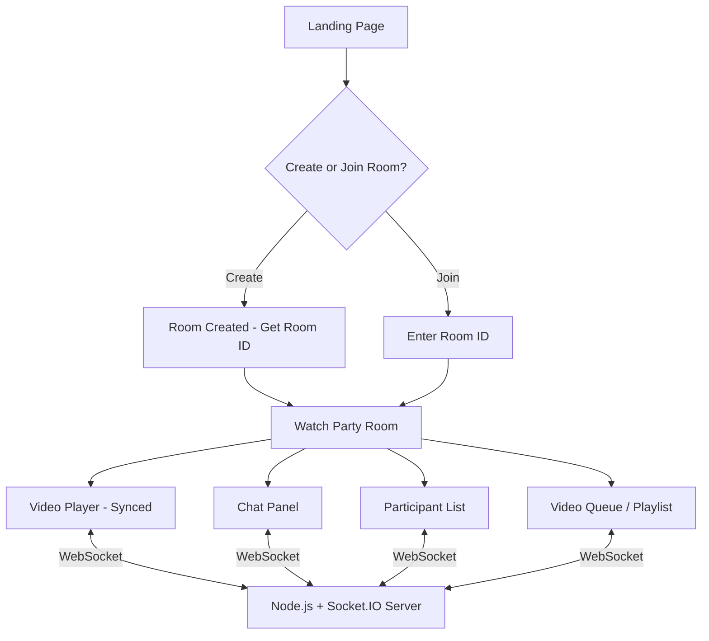

# PlayStream — Watch Party Web Application

Build a real-time Watch Party web app where users can create rooms, invite friends, and watch videos together with synchronized playback and live chat.

## Proposed Architecture

### Tech Stack
| Layer | Technology |
|-------|-----------|
| Frontend | HTML5, Vanilla CSS, Vanilla JavaScript |
| Backend | Node.js + Express + Socket.IO |
| Video Player | HTML5 `<video>` element with custom controls |
| Real-time Sync | Socket.IO (WebSocket) |
| Fonts | Google Fonts (Inter) |
| Icons | Lucide Icons (via CDN) |

## User Review Required

> [!IMPORTANT]
> **Video Source**: The app will support pasting a direct video URL (MP4, WebM, etc.) or YouTube embed URLs. It will **not** include a cloud virtual browser for streaming services like Netflix. Is this scope acceptable?

> [!IMPORTANT]
> **No Database**: Room state and chat will be stored **in-memory** on the server. When the server restarts, all rooms are lost. This keeps the initial version simple. Should we add persistence later?

## Open Questions

> [!NOTE]
> **Authentication**: The current plan uses a simple "enter your display name" flow — no accounts or sign-up. Is that sufficient?

> [!NOTE]
> **Deployment**: The plan creates a local dev server. Are there any deployment targets (Vercel, Railway, etc.) you'd like me to configure?

---

## Proposed Changes

### 1. Project Setup & Configuration

#### [NEW] [package.json](file:///d:/Ashik/PlayStream/package.json)
- Node.js project with Express, Socket.IO dependencies
- Dev scripts: `npm run dev` (nodemon), `npm start`

#### [NEW] [.gitignore](file:///d:/Ashik/PlayStream/.gitignore)
- Standard Node.js .gitignore

---

### 2. Backend — Real-Time Server

#### [NEW] [server.js](file:///d:/Ashik/PlayStream/server.js)
Core Node.js + Express + Socket.IO server handling:
- **Room Management**: Create rooms (generate unique 6-char codes), join rooms, leave rooms
- **Video Sync**: Broadcast play/pause/seek/video-change events to all room participants
- **Chat Relay**: Broadcast chat messages within rooms
- **Participant Tracking**: Track connected users per room, broadcast join/leave notifications
- **Video Queue**: Maintain a shared playlist per room
- **Host Controls**: Room creator is the "host" with exclusive playback control authority
- Serves static frontend files from `/public`

---

### 3. Frontend — Landing Page

#### [NEW] [public/index.html](file:///d:/Ashik/PlayStream/public/index.html)
Premium landing page with:
- Animated gradient background with floating particles
- App logo and tagline ("Watch Together. Anywhere.")
- Two CTAs: **Create Room** and **Join Room**
- Display name input field
- Join Room modal with room code input
- Responsive layout

#### [NEW] [public/css/landing.css](file:///d:/Ashik/PlayStream/public/css/landing.css)
- Dark cinematic theme (deep navy/purple palette)
- Glassmorphism cards and modals
- Animated gradient background
- Particle animation system
- Button hover effects with glow
- Smooth modal transitions
- Mobile responsive breakpoints

#### [NEW] [public/js/landing.js](file:///d:/Ashik/PlayStream/public/js/landing.js)
- Create room → redirect to `/room.html?room=XXXXXX&name=UserName`
- Join room → validate code → redirect
- Particle animation engine
- Form validation

---

### 4. Frontend — Watch Party Room

#### [NEW] [public/room.html](file:///d:/Ashik/PlayStream/public/room.html)
The main watch party experience with a multi-panel layout:
- **Left**: Video player (70% width) with custom controls
- **Right**: Sidebar with tabs for Chat, Participants, Queue
- **Top Bar**: Room info (code, copy button), participant count, leave button
- **Video Controls**: Custom play/pause, seek bar, volume, fullscreen
- **Chat Panel**: Message list, input, emoji reactions
- **Participants Panel**: Avatar list, host badge, online indicators
- **Queue Panel**: Add video URL, drag-to-reorder playlist, now-playing indicator

#### [NEW] [public/css/room.css](file:///d:/Ashik/PlayStream/public/css/room.css)
- Cinematic dark layout optimized for video viewing
- Glassmorphic sidebar panels
- Custom video player controls (overlaid)
- Chat message bubbles with timestamps
- Participant cards with status indicators
- Tab switching animation
- Video queue cards
- Responsive: sidebar collapses to bottom sheet on mobile
- Subtle micro-animations throughout

#### [NEW] [public/js/room.js](file:///d:/Ashik/PlayStream/public/js/room.js)
Core room logic:
- **Socket.IO Connection**: Connect to server, join room, handle reconnection
- **Video Sync Engine**:
  - Listen to local video events (play, pause, seeked) → emit to server
  - Receive remote events → apply to local player
  - "Ignore remote" flag to prevent infinite event loops
  - Periodic drift correction (every 5s, sync if >0.5s drift)
- **Chat System**: Send/receive messages, auto-scroll, timestamps
- **Participant Management**: Real-time join/leave updates, participant list rendering
- **Video Queue**: Add URLs, manage playlist, auto-advance to next video
- **Host Controls**: Only host can control playback; others see synced state
- **UI Interactions**: Tab switching, copy room code, leave room, emoji reactions
- **Notification Toasts**: User join/leave, video changed, connection status

#### [NEW] [public/css/shared.css](file:///d:/Ashik/PlayStream/public/css/shared.css)
- CSS custom properties (design tokens): colors, spacing, typography, shadows
- Glassmorphism utility classes
- Button variants (primary, secondary, ghost)
- Toast notification styles
- Scrollbar styling
- Animation keyframes (fadeIn, slideUp, pulse, float)
- Base resets and typography

---

### 5. Assets

#### [NEW] Logo/Favicon
- Generate a PlayStream logo using the image generation tool
- Simple, modern icon representing synchronized playback

---

## Feature Summary

| Feature | Description |
|---------|-------------|
| 🏠 Landing Page | Create or join rooms with a display name |
| 🎬 Synced Video | Play/pause/seek synced across all participants |
| 💬 Live Chat | Real-time text chat with timestamps |
| 👥 Participants | See who's in the room, host badge |
| 📋 Video Queue | Shared playlist, add videos by URL |
| 🎨 Premium UI | Dark cinematic theme, glassmorphism, animations |
| 📱 Responsive | Works on desktop and mobile |
| 🔗 Easy Sharing | Copy room code with one click |
| 🔔 Notifications | Toast alerts for events (join, leave, video change) |

---

## Verification Plan

### Automated Tests
- Start the server with `npm run dev`
- Open the app in the browser and visually verify:
  1. Landing page renders with animations
  2. Create a room → redirects to room page
  3. Open a second browser tab → join the same room
  4. Verify video sync (play/pause/seek in one tab reflects in other)
  5. Send chat messages between tabs
  6. Verify participant list updates
  7. Test video queue functionality
  8. Test responsive layout at different viewport sizes

### Browser Testing
- Use the browser subagent to navigate through the complete flow
- Capture screenshots of key pages for the walkthrough
