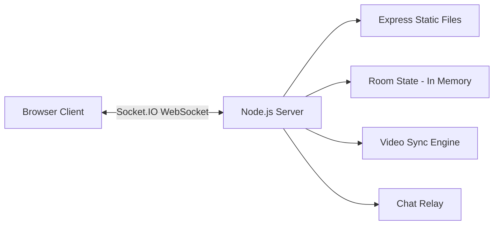

# PlayStream — Build Walkthrough

## What Was Built

A full-featured **Watch Party** web application where users can create rooms, invite friends via room codes, and watch videos together with synchronized playback and live chat.

## Architecture



## Files Created

| File | Purpose |
|------|---------|
| [package.json](file:///d:/Ashik/PlayStream/package.json) | Project config with Express + Socket.IO deps |
| [server.js](file:///d:/Ashik/PlayStream/server.js) | Backend: room mgmt, video sync, chat, queue |
| [public/index.html](file:///d:/Ashik/PlayStream/public/index.html) | Landing page HTML |
| [public/room.html](file:///d:/Ashik/PlayStream/public/room.html) | Watch party room HTML |
| [public/css/shared.css](file:///d:/Ashik/PlayStream/public/css/shared.css) | Design system: tokens, glass, buttons, animations |
| [public/css/landing.css](file:///d:/Ashik/PlayStream/public/css/landing.css) | Landing page styles |
| [public/css/room.css](file:///d:/Ashik/PlayStream/public/css/room.css) | Room page styles |
| [public/js/landing.js](file:///d:/Ashik/PlayStream/public/js/landing.js) | Landing: particles, room create/join flow |
| [public/js/room.js](file:///d:/Ashik/PlayStream/public/js/room.js) | Room: video sync, chat, queue, participants |

## Features Implemented

- ✅ **Room Creation** — Generate unique 6-char room codes
- ✅ **Room Joining** — Join via code with validation
- ✅ **Synchronized Video** — Play/pause/seek synced for all participants via host control
- ✅ **Live Chat** — Real-time text messaging with avatars and timestamps
- ✅ **Emoji Reactions** — Floating emoji reactions visible to all
- ✅ **Participant List** — Real-time join/leave tracking with host badge
- ✅ **Video Queue** — Shared playlist, add/remove/play from queue
- ✅ **Host Transfer** — Auto-assigns new host when original host disconnects
- ✅ **Copy Room Code** — One-click clipboard copy
- ✅ **Keyboard Shortcuts** — Space (play/pause), F (fullscreen), M (mute)
- ✅ **Mobile Responsive** — Sidebar collapses to slide-in panel
- ✅ **Toast Notifications** — Contextual alerts for events
- ✅ **Particle Animation** — Animated background on landing page
- ✅ **Glassmorphism UI** — Premium dark theme with frosted glass panels

---

## Screenshots

### Landing Page


### Room Page — People Tab


### Room Page — Chat with Emoji Reaction


### Room Page — Video Loaded with Queue


### Full Flow Recording


---

## How to Run

```bash
cd d:\Ashik\PlayStream
npm install        # Install dependencies (already done)
npm run dev        # Start dev server with auto-reload
```

Open **http://localhost:3000** in your browser.

## Testing Multi-User Sync

1. Open http://localhost:3000 in **Tab 1** → Create a room
2. Copy the room code
3. Open http://localhost:3000 in **Tab 2** → Join the room with the code
4. Load a video URL in Tab 1 (host) → it syncs to Tab 2
5. Play/pause/seek in Tab 1 → reflected in Tab 2
6. Send chat messages from either tab → visible in both

## Test Results

| Test | Result |
|------|--------|
| Landing page loads with particles | ✅ Pass |
| Create room generates code | ✅ Pass |
| Room page renders correctly | ✅ Pass |
| Chat messages send/receive | ✅ Pass |
| Emoji reactions float | ✅ Pass |
| Video queue add/display | ✅ Pass |
| Video loads from URL | ✅ Pass |
| People tab shows host badge | ✅ Pass |
| Tab switching works | ✅ Pass |
